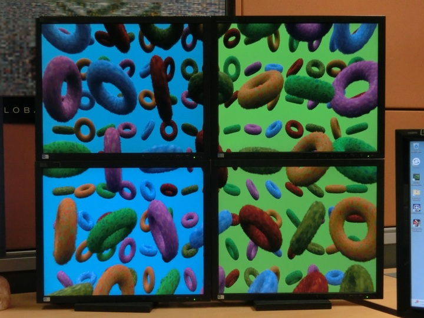

# vk_ddisplay

This sample demonstrates multi-GPU rendering and presenting to ddisplays, meaning displays that are not part of the Windows desktop and of which an application takes complete control. While the already existing sample [gl_render_vk_ddisplay](https://github.com/nvpro-samples/gl_render_vk_ddisplay) demonstrates the acquisition of a single ddisplay and rendering through OpenGL/Vulkan interop, this sample works solely with Vulkan and supports multiple ddisplays and GPUs within a single app instance.



## Introduction

The Windows Display Driver Model (WDDM) provides built-in support for [head-mounted and specialized monitors](https://learn.microsoft.com/en-us/windows-hardware/drivers/display/specialized-monitors). This set of displays include, for example, large projector or video walls. They will be ignored by the Windows Desktop Manager (DWM), and an app may acquire them for dedicated control and presentation. This sample demonstrates how this can be achieved through the Vulkan API.

NVIDIA Mosaic™ is a technology to create a single virtual display which consists of multiple physical ones, arranged in a rectangular grid. A single swapchain can be created for such a display even if the individual physical displays are connected to different GPUs. Each individual GPU is then responsible for its own dedicated region within the swapchain. The Vulkan API may be used to implement work-balanced multi-GPU rendering without the need to transfer individual frames or part of frames to the displaying GPU, as was the case with traditional NVLink/SLI configurations. The sample features a basic implementation of that too.

The sample can handle an arbitrary number of displays and GPUs. It features a sample scene reminiscent of common stability benchmarks and renders it across enabled displays all at once. The scene's complexity can be adjusted on a per-GPU basis to simulate the effects of different graphics workloads while keeping synchronous presents.

## System Requirements

Only certain editions of Windows (Windows 11 Enterprise, Windows 11 Pro for Workstations) support removing a display from the desktop, for more details please refer to the [Microsoft documentation](https://learn.microsoft.com/en-us/windows-hardware/drivers/display/specialized-monitors).

In addition to this requirement, the NVIDIA driver implementation of this feature is only supported on Windows 11 and later, in the Windows editions discussed in the Microsoft documentation.

Because all ddisplays will be removed from the desktop and Windows needs at least one active desktop display, at the very least two physical displays are required.

## Preparation Workflow

### Create a virtual Mosaic display (recommended on multi-GPU systems)

[NVIDIA Mosaic](https://www.nvidia.com/en-us/design-visualization/solutions/nvidia-mosaic-technology/) is supported on NVIDIA RTX and NVIDIA Quadro professional visualization products. For optimal performance, use identical GPUs and connect the same number of displays to each GPU. Also note that, for the displays to be frame-locked when the displays are distributed across more than one GPU, either a [NVIDIA Quadro Sync](https://www.nvidia.com/en-us/design-visualization/solutions/quadro-sync/) board or an NVLink bridge must be present. A Mosaic display can be created through the NVIDIA Control Panel or with the [configureMosaic.exe](https://www.nvidia.com/en-us/drivers/mosaic-utility-2_1_1-driver/) command line tool.

For example, consider this setup, consisting of a 2x2 Mosaic virtual display and a single control display which will stay as part of the desktop.
```
┌────────┐  ┌────────┬────────┐
│ GPU  0 │  │ GPU  1 │ GPU  2 │
│ Disp 0 │  │ Disp 0 │ Disp 0 │
└────────┘  ├────────┼────────┤
            │ GPU  1 │ GPU  2 │
            │ Disp 1 │ Disp 1 │
            └────────┴────────┘
```
To create this setup use the following command line. For more information about each argument call `.\configureMosaic.exe --help`.
```
.\configureMosaic.exe --force set rows=1 cols=1 out=0,0 nextgrid rows=2 cols=2 out=0,0 out=1,0 out=0,1 out=1,1
```
Please note that `configureMosaic.exe` needs administrator privileges.

### Remove displays from desktop

When using Mosaic to combine multiple displays into one virtual display, only that single virtual display is visible to Windows and thus can be removed from the desktop. When not using Mosaic, each physical display can be removed individually (except for the last one).

Displays can be queried, removed from, and returned to the desktop with [configureDDisplay.exe](https://www.nvidia.com/en-us/drivers/ddisplay-utility/). To begin, call `.\configureDDisplay.exe status` to query the current system topology. A typical output may look like this.

```
Display Adapters
  Adapter |                   |   Can  |
   Index  |    OS AdapterId   | Manage | Adapter Name
  --------+-------------------+--------+--------------------------------
        0 | 00000000-013cc1f2 |   Yes  | NVIDIA RTX A6000
        1 | 00000000-013aeacf |   Yes  | NVIDIA Quadro RTX 6000

Displays
  Display | Adapter |   NVAPI   |    OS    |                                    |    Source    |
   Index  |  Index  | DisplayId | TargetId |               Status               |  Resolution  | Display Name
  --------+---------+-----------+----------+------------------------------------+--------------+-------------
        0 |    0    |  82061083 |    41100 |        Desktop @(2560,236)         | 1920 x 1200  |
        1 |    0    |  83e333e2 |    4121f |           Desktop @(0,0)           | 2560 x 1440  |
        2 |    0    |  832ea251 |    4122c |         Desktop @(-2560,0)         | 2560 x 1440  |
        3 |    1    |  8006108a |     1400 |        Desktop @(4480,-724)        | 3840 x 2160  |
```
In this example, the system consists of two NVIDIA Quadro RTX 6000, reported as a single adapter with index 1. This happens when two or more individual GPUs form an LDA group as is the case when they are part of a single Mosaic display configuration. Later on in Vulkan, they will analogously be exposed as two physical devices inside the same device group.

Attached to adapter 1 is a single display (with index 3) which will be removed from the desktop in the next step to make it usable by this sample app. This is achieved by calling `.\configureDDisplay.exe remove-from-desktop -index=3`. The status of that display should now change from the its position on the desktop to something like this.
```
|   Removed, Managed, Not Acquired   |
```
_Removed_ means that the display is not part of the desktop anymore. Accordingly, the display will be black. _Managed_ means that the display is managed by the driver and ready to be used as a ddisplay. Finally, _Not Acquired_ means that currently no app is using this display as a presentation device. This will change to _Acquired_ later on when the app calls `vkAcquireWinrtDisplayNV()`.

When done, the display can be returned to the desktop with `.\configureDDisplay.exe return-to-desktop -index=3`.

Please note that `configureDDisplay.exe` needs administrator privilege to change system state. The `status` command does not need administrator privilege.

## Build and Run

Clone https://github.com/nvpro-samples/nvpro_core.git next to this repository (or pull latest `main` if you already have it):

`mkdir build && cd build && cmake .. # Or use CMake GUI`

If there are missing dependencies (e.g. glfw), run `git submodule update --init --recursive --checkout --force` in the `nvpro_core` repository.

Then start the generated `.sln` in VS or run `make -j`.

Run `../../bin_x64/Release/vk_ddisplay.exe`

You are advised not to run the debug build unless you have the required validation layers.

Please note that the most recent Vulkan SDK at the time of release (1.3.275) contains a bug that may result in a handful of validation errors when running the sample. We recommend muting the folowing message VUIDs in the Vulkan Configurator.

* `VUID-VkSwapchainCreateInfoKHR-surface-01270`
* `VUID-vkGetPhysicalDevicePresentRectanglesKHR-surface-06211`
* `VUID-vkGetPhysicalDeviceSurfaceCapabilitiesKHR-surface-06211`
* `VUID-vkQueuePresentKHR-pSwapchains-01292`

## Configuration

By default the app will render only to the first ddisplay it encounters. It makes no sense to implement a heuristic for any additional display, because the displays' actual locations and orientations in the real world are completely unknown to the app. In this case, the desired behavior can be achieved through a user-defined configuration file in json format.

The root object of the json file must provide two base objects; `canvas` and `displays`.
```json
{
    "canvas": {
        // ...
    },
    "displays": [
        // ...
    ]
}
```

### Canvas

The canvas – as the name suggests – defines an abstract rectangular render target for the application's camera to draw its image. Its extent is from 0 to 1 in both, x and y directions with (0,0) as the top left corner. Its only properties are the camera's field of view (in degrees) and its aspect ratio given by two integers, the numerator and denominator.
```json
"canvas": {
    "fov": 90,
    "aspectNum": 16,
    "aspectDen": 9
}
```

### Displays

The `displays` array defines which displays are part of the canvas and their respective positions on it. Each display can be positioned anywhere on the canvas and with arbitrary non-uniform scaling. Overlaps between different displays are allowed as well, which is useful especially for projector setups.

The sample provides the command line argument `-topology-only` to only print the system's topology (as seen by the sample) and a list of displays that can be used as a region on the canvas. A sample output might look like this.
```
--------------------------------------------------------------------------------
System topology:
device group [0]
 physical device [0]: NVIDIA RTX A6000 {e07f-4c17-08d3-4aa7-7d74-1dca-82e7-0c13}
device group [1]
 physical device [0]: Quadro RTX 6000 {5120-14f9-a976-1115-c734-2896-d2a3-16e9}
  display [0]: Generic display; supported display modes: 1920 x 1080 @ 60.000 Hz
device group [2]
 physical device [0]: Quadro RTX 6000 {219b-a938-10c8-957e-397e-d1c2-447a-afd7}
  display [0]: Generic display; supported display modes: 1920 x 1080 @ 60.000 Hz
--------------------------------------------------------------------------------
Usable displays:
[0] Generic display: attached to physical device(s) { 0 } of device group 1.
[1] Generic display: attached to physical device(s) { 0 } of device group 2.
--------------------------------------------------------------------------------
```
In the configuration file, each display can be referenced by its index provided through the `Usable displays` section of the sample's output. In case of a single (Mosaic) display, it is sufficient to provide the desired display's index. If no further information is provided, it will fill the entire canvas automatically.
```json
"displays": [0]
```
However, let's consider the two displays from above are physically arranged side by side and the canvas should span across both like this.
```
Desired canvas configuration:
(0,0)┌────────┬────────┐
     │        │        │
     │ Disp 0 │ Disp 1 │
     │        │        │
     └────────┴────────┘(1,1)
```
In case of more than one display, their exact locations on the canvas, i.e., the x,y coordinates of their top left corner and their extents, can be provided like this.
```json
"displays": [
    {
        "index": 0,
        "canvasOffsetX": 0.0,
        "canvasOffsetY": 0.0,
        "canvasWidth": 0.5,
        "canvasHeight": 1.0
    },
    {
        "index": 1,
        "canvasOffsetX": 0.5,
        "canvasOffsetY": 0.0,
        "canvasWidth": 0.5,
        "canvasHeight": 1.0
    }
]
```
Please note that although a Mosaic may be made up of multiple displays, to the application it is just a single one and thus the default behavior should be sufficient in most cases.

The configuration file can be passed to the sample with the `-config` command line argument.
```
.\vk_ddisplay -config custom_configuration.json
```

## Usage
In addition to the rendering itself, the sample includes a control window with a user interface (UI) for adjusting various rendering options dynamically at runtime.

* The number of donuts in horizontal and vertical direction (hotkeys: `←`, `→`, `↑`, and `↓`)
* The number of layers to render the donuts' fur (hotkeys: `+` and `-`)
* Pausing and resuming of the rendering (hotkey: `spacebar`)

By default, the hotkeys for adjusting the number of layers affect all render threads simultaneously. However, using the `PgUp` and `PgDn` keys will cycle through the individual render threads, including groups of render threads. When adjusting the number of fur layers with the previously mentioned hotkeys, the changes are specifically applied to the corresponding regions on the canvas associated with the active render thread(s).

## LICENSE

Copyright 2024 NVIDIA CORPORATION. Released under Apache License,
Version 2.0. See "LICENSE" file for details.
